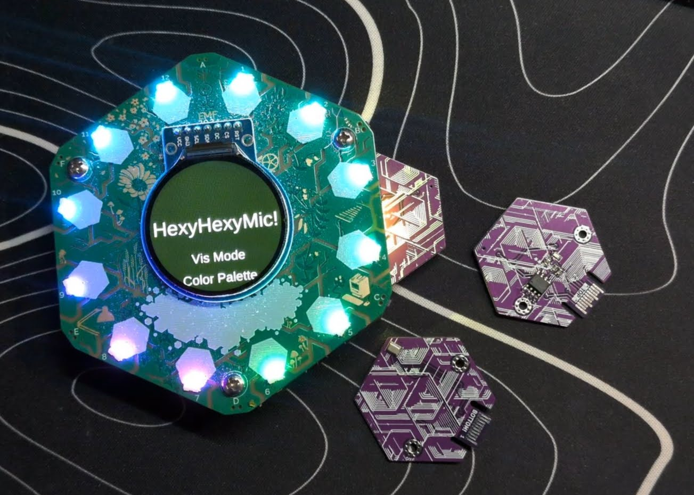

# HexyHexyMic

Because EMF needed more flashy lights!

If you're here, there's a good chance you've picked up one of my **HexyHexyMic** Hexpansions. I hope I got the chance to say hello! If not, you can find me on Mastodon: **@GlitchEngine@mastodon.social**.

HexyHexyMic adds a digital microphone to the Tildagon badge, along with a collection of audio-reactive visualisations for the badge LEDs.

This was my first attempt at building a Tildagon Hexpansion, and also my first serious dive into audio signal processing. 

The entire application is written in MicroPython and is baked into the EEPROM on the Hexpansion.

If you enjoyed this project or picked up a HexyMic at EMF2026, donations towards parts and future projects are appreciated, but never expected:
https://ko-fi.com/AlexJMcIntyre

https://paypal.me/AlexJMcIntyre

----------

## Usage

The app lives on the Hexpansion itself, so there are **no downloads or internet connection required**.

Simply plug the Hexpansion into your badge and it should launch automatically. If the badge is powered on with the Hexpansion already connected, it should load immediately during startup.

To exit the app gracefully, press the **F** button (top left).

Removing the Hexpansion should also exit automatically. If your LEDs don't return afterwards, try toggling them back on from the badge menu or simply reboop the badge.

### Controls

-   **Up / Down**: Navigate the menu
-   **C** (bottom right): Select an option
-   **F** (top left): Exit the application

----------

## Visualisation Modes

### RMS (default)

Uses the **Root Mean Square** of the incoming audio as a measure of volume.

The louder the sound, the more LEDs illuminate.

### Zero Crossing (ZC)

Counts how often the audio waveform crosses zero to estimate its average pitch.

It's a very lightweight algorithm that gives surprisingly fun results despite being only a rough approximation.

### FFT

Performs a tiny **Fast Fourier Transform** to estimate the energy in twelve frequency bands.

This isn't intended to be an accurate spectrum analyser, but it's fast enough to run smoothly on the badge and gives a satisfying visual representation of the music.

### Vortex

Attempts to detect the beat of whatever it's listening to and synchronise a rotating comet of light with the rhythm.

It's definitely more artistic than scientific, but I think it looks rather nice.

----------

## Beat Flash

When enabled, the app attempts to detect musical beats from the incoming audio. Whenever it thinks it has found one, the LEDs briefly desaturate to create a bright flash effect.

Beat detection is intentionally simple, so don't expect perfect DJ-grade synchronisation. It works best with music that has a clear, steady rhythm.

----------

## Automatic Volume Calibration

The visualisers automatically adapt to the ambient sound level.

This means they work just as well in a quiet workshop as they do in a noisy concert.

If you make an unusually loud noise (for example by tapping the microphone), the display may become less sensitive for a few seconds while it recalibrates itself.

----------

## Compatibility

Tested with **Tildagon firmware 1.10**.

----------

## Hacking on HexyHexyMic

The source is included in this repository, but unlike a normal Python application it isn't installed directly onto the badge.

The app is flashed onto the Hexpansion's EEPROM, allowing it to run automatically whenever the Hexpansion is plugged into a Tildagon.

To build or modify the app you'll currently need:

- A checkout of the Tildagon firmware repository
- This project's source files
- A way of flashing the EEPROM on the Hexpansion

I've included the batch files I use to build and flash the EEPROM image as a starting point. They're fairly simple, but you'll need to adjust the paths for your own setup.

If you improve the code or add new visualisation modes, I'd love to hear about it!
